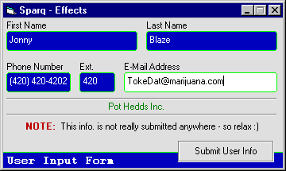



## Get away from repetative VB Controls\! NO EXTERNAL FILES\!\!

### Description

This code will give you some ideas on how to

break away from VB's standard controls, using

VB's standard controls. Ironic isn't it? :)

Included: Specialized Textboxes

Specialized Command Buttons

Scrolling Text

SelStart / SelLength
 
### More Info
 

             |
---                |---
**Submitted On**   |2000-07-25 10:06:24
**By**             |[Sparq](https://github.com/Planet-Source-Code/PSCIndex/blob/master/ByAuthor/sparq.md)
**Level**          |Beginner
**User Rating**    |4.6 (23 globes from 5 users)
**Compatibility**  |VB 5\.0, VB 6\.0
**Category**       |[Custom Controls/ Forms/  Menus](https://github.com/Planet-Source-Code/PSCIndex/blob/master/ByCategory/custom-controls-forms-menus__1-4.md)
**World**          |[Visual Basic](https://github.com/Planet-Source-Code/PSCIndex/blob/master/ByWorld/visual-basic.md)
**Archive File**   |[CODE\_UPLOAD81367252000\.zip](https://github.com/Planet-Source-Code/sparq-get-away-from-repetative-vb-controls-no-external-files__1-10047/archive/master.zip)

